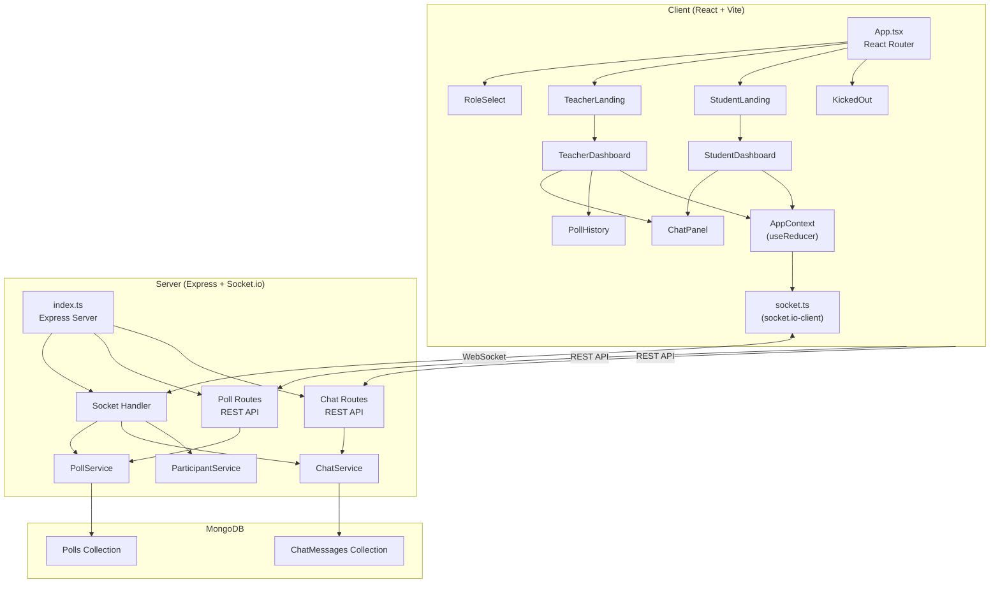
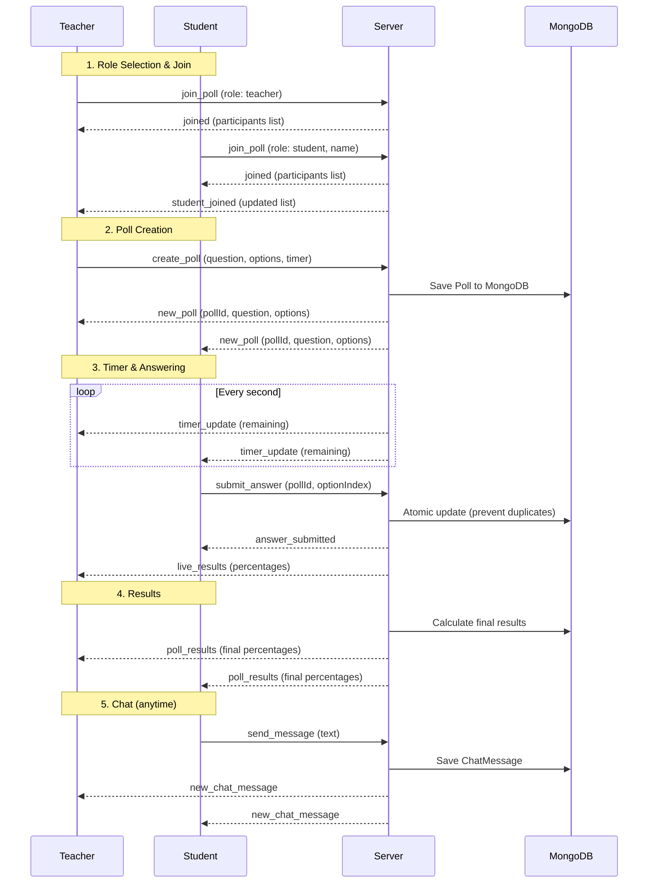
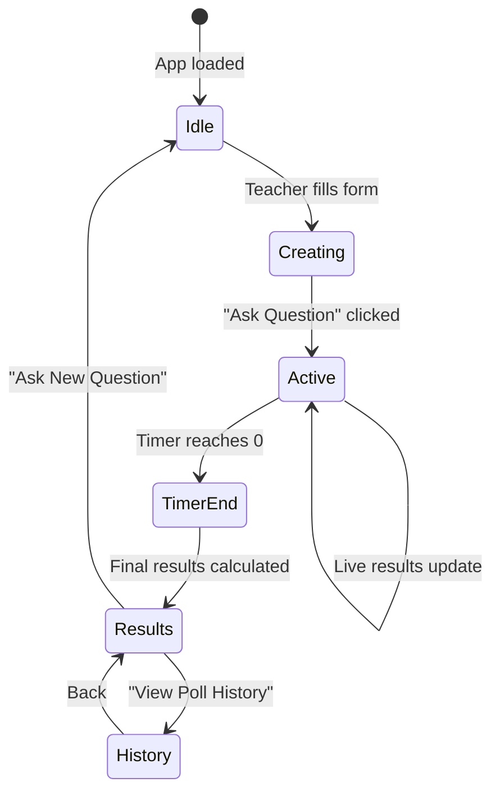
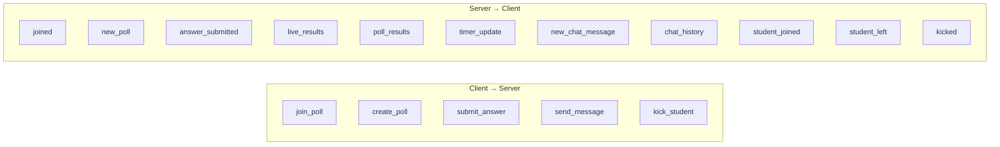

# Intervue Poll — Live Polling System

A real-time live polling application where teachers can create polls and students can answer them in real-time. Built with React, Node.js, Socket.io, and MongoDB.

    

---

## Features

- **Role-Based Access** — Users choose between Teacher or Student role
- **Real-Time Polling** — Teachers create polls; students answer live with countdown timer
- **Live Results** — Bar chart results update in real-time as students vote
- **Poll History** — All past polls stored in MongoDB and viewable via history page
- **Live Chat** — Real-time chat between all participants, persisted to database
- **Participant Management** — Teachers can view connected students and kick them
- **Session Persistence** — Users automatically rejoin on page refresh
- **Atomic Vote** — MongoDB atomic operations prevent duplicate votes

---

## Architecture Overview



---

## Application Flow



---

## Poll Lifecycle



---

## Socket Events



---

## Tech Stack

| Layer | Technology |
|-------|-----------|
| **Frontend** | React 19, TypeScript, Vite, Tailwind CSS 3, React Router 7 |
| **Backend** | Node.js, Express 5, TypeScript |
| **Real-Time** | Socket.io 4.8 (client + server) |
| **Database** | MongoDB Atlas, Mongoose 9 |
| **State** | React Context + useReducer |
| **Notifications** | react-hot-toast |

---

## Project Structure

```
├── client/                     # React frontend
│   ├── src/
│   │   ├── App.tsx             # Router setup
│   │   ├── socket.ts           # Socket.io client instance
│   │   ├── components/
│   │   │   ├── RoleSelect.tsx        # Role selection page
│   │   │   ├── TeacherLanding.tsx    # Teacher join page
│   │   │   ├── StudentLanding.tsx    # Student name + join page
│   │   │   ├── TeacherDashboard.tsx  # Poll creation, results, live view
│   │   │   ├── StudentDashboard.tsx  # Answer polls, view results
│   │   │   ├── ChatPanel.tsx         # Chat + participants panel
│   │   │   ├── PollHistory.tsx       # Historical poll results
│   │   │   └── KickedOut.tsx         # Kicked student page
│   │   ├── context/
│   │   │   └── AppContext.tsx        # Global state (useReducer)
│   │   ├── hooks/
│   │   │   ├── useSocketEvents.ts    # Socket event listeners
│   │   │   └── useSessionPersistence.ts  # Auto-rejoin on refresh
│   │   └── types/
│   │       └── index.ts              # TypeScript interfaces
│   └── package.json
│
├── server/                     # Express backend
│   ├── src/
│   │   ├── index.ts            # Server entry point
│   │   ├── config/
│   │   │   └── db.ts           # MongoDB connection (retry logic)
│   │   ├── models/
│   │   │   ├── Poll.ts         # Poll Mongoose schema
│   │   │   └── ChatMessage.ts  # Chat Mongoose schema
│   │   ├── routes/
│   │   │   ├── pollRoutes.ts   # GET /api/polls, GET /api/polls/:id
│   │   │   └── chatRoutes.ts   # GET /api/chat
│   │   ├── services/
│   │   │   ├── PollService.ts        # Poll business logic
│   │   │   ├── ChatService.ts        # Chat business logic
│   │   │   └── ParticipantService.ts # In-memory participant tracking
│   │   └── socket/
│   │       └── index.ts        # Socket.io event handlers
│   └── package.json
│
└── README.md
```

---

## Getting Started

### Prerequisites

- Node.js (v18+)
- MongoDB (local or Atlas connection string)

### 1. Clone & Install

```bash
git clone <repo-url>
cd Intervue_assignment

# Install server dependencies
cd server
npm install

# Install client dependencies
cd ../client
npm install
```

### 2. Configure Environment

**Server** — create `server/.env`:

```env
PORT=5000
MONGODB_URI=mongodb://localhost:27017/intervue_poll
CLIENT_URL=http://localhost:5173
```

**Client** — optionally create `client/.env`:

```env
VITE_SOCKET_URL=http://localhost:5000
VITE_API_URL=http://localhost:5000
```

> Defaults to `http://localhost:5000` if not set.

### 3. Run

```bash
# Terminal 1 — Start server
cd server
npm run dev

# Terminal 2 — Start client
cd client
npm run dev
```

Open [http://localhost:5173](http://localhost:5173) in your browser.

---

## API Endpoints

| Method | Endpoint | Description |
|--------|----------|-------------|
| `GET` | `/api/polls` | Get all polls with calculated results |
| `GET` | `/api/polls/:id` | Get a specific poll by ID |
| `GET` | `/api/chat` | Get all chat messages |

---

## Key Design Decisions

1. **Atomic Voting** — Uses MongoDB `findOneAndUpdate` with `$addToSet` to prevent duplicate votes per student per poll
2. **Server-Side Timer** — Timer runs on the server to prevent client-side manipulation; emits updates every second
3. **Service Layer Pattern** — Business logic separated into `PollService`, `ChatService`, `ParticipantService` for clean architecture
4. **Session Persistence** — `sessionStorage` stores user role/name; auto-rejoins via socket on page refresh
5. **Single Teacher Enforcement** — Only one teacher allowed at a time; stale socket detection prevents lockout
6. **In-Memory Participants** — Connected users tracked in-memory `Map` for fast lookups (polls/chat persisted to MongoDB)

---
